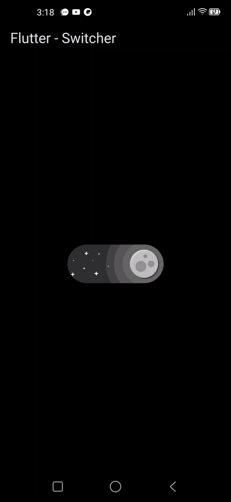

# Flutter UI Button Switch Test

This project is a test application demonstrating a **UI Button Switch** in Flutter. The button switch allows users to toggle between two states, visually representing the changes with animations and color transitions.

## Features

- **Custom Switch Button**: A simple and interactive UI component that switches between two states.
- **Smooth Color Transition**: The button smoothly transitions between colors when toggled.
- **Responsive Design**: The UI adapts to different screen sizes.
- **Touch Feedback**: Provides haptic feedback upon user interaction.

## Demo

Here is a preview of the button switch UI:



## Installation

1. Clone the repository:

   ```bash
   git clone https://github.com/jaiendev/flutter-switcher.git

2. Install the dependencies:

   ```bash
   flutter pub get

2. Install the dependencies:

   ```bash
   flutter run